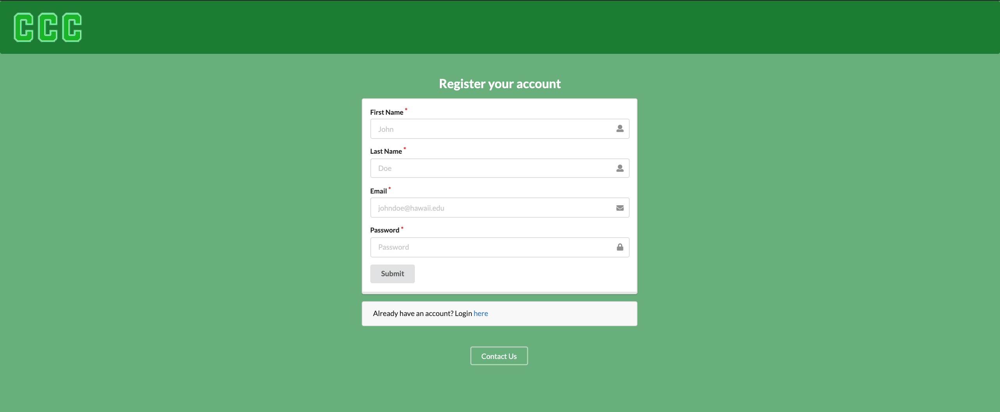
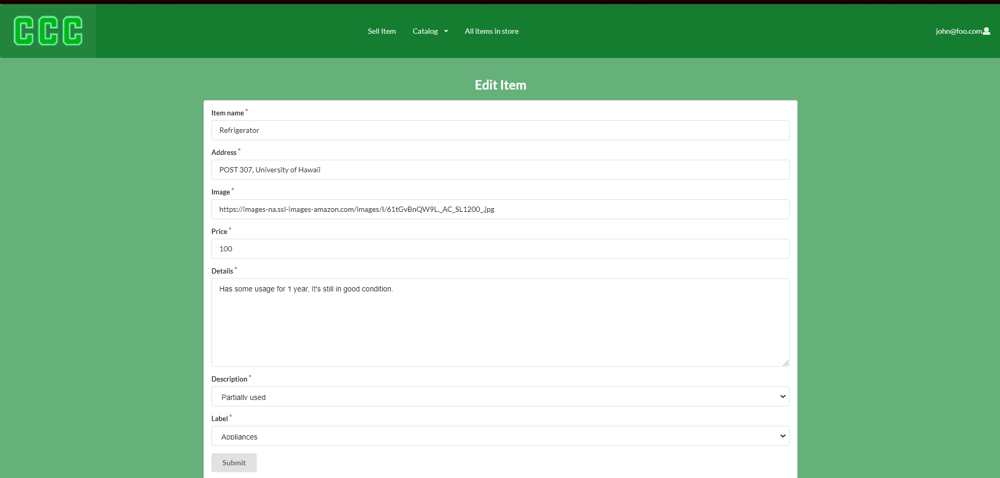
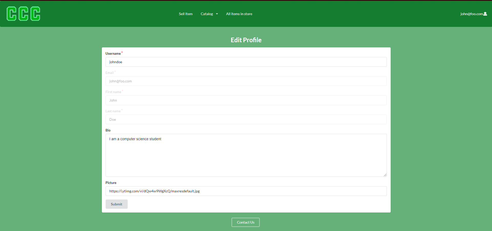

## Description
Campus Clearout Center is a program that will allow users of the UHM community to list and post various objects for sale. After all, another man's trash is another man's treasure. But for the UHM community this could be old textbooks, "campus-specific" goods, generally things that need to be recycled which might offer use to another student. The service will allow buyers to easily browse through the item and choose a location on campus to meet.

## Deployment
[Deployment](https://campusclearout.xyz/#/)

## Project Pages
- [M1](https://github.com/orgs/campus-clearout-center/projects/1)
- [M2](https://github.com/orgs/campus-clearout-center/projects/2)
- [M3](https://github.com/orgs/campus-clearout-center/projects/3)

## Team Members
- Skyler Kimura
- Chase Lee
- Daphne Oh
- Benny Trieu

## System
- [Landing page](#landing-page)
- [Register page](#register-page)
- [Sign in page](#log-in-page)
- [User home page](#user-home-page)
- [List all page](#list-all-page)
- [Catalog page](#catalog-page)
- [Sell item page](#sell-item-page)
- [Edit item page](#edit-item-page)
- [Offers page](#offer-page)
- [Report item page](#report-page)
- [Profile page](#profile-page)
- [Edit profile page](#edit-profile-page)
- [Other's Profile Page](#other's-profile-page)
- [Sign out page](#sign-out-page)
- [Admin home page(Admin)](#admin-home-page)
- [Report list page(Admin)](#report-list-page)
- [Delete report page(Admin)](#delete-report-page)
- [Delete item page(Admin)](#delete-item-page)
- [Contact us page](#contact-us-page)

## Goal
By the end of the project we will have a working program that will allow users to easily post items that they would like to sell using picture, browse the items posted, and buy the items or make an offer on an item using a form.

## Community Feedback
The overall feedback we got from UH community members was that our website was simple and well formatted. It was not too distracting and they found it to be usefull for students who are moving out an easier way to sell their stuff. 
We received these common critics about our website and changed them in order to make our design more user friendly : 
- Image option is a little confusing
- Home text page is hard to read
- Logo would look better in white
- More context on home page to explain the website for first time users.

# User Guide
This section provides a walkthrough of our campus clearout center user interface and its capabilities.

### Landing page
This is the page that the viewer will first see when opening up the website. It is a nice sunset picture of campus center that is given two options in the middle which is to login and register for the website.


### Register page
If the user does not have an account, they will have to enter their first and last name, email, and password. The register page will require them to enter all the information, and when they click submit their account will created. 



### Log in page
Users add their username and password, and when they click submit, they are brought to the home page. If the user does not have a profile, then they can click on the "Click here to register" button.


### User Home page
When the user signs in, They are given options above like "List Item" and "Create Item" on the top navbar alongside a profile indicator on the topright which can direct them to a profile page of their own or the option to sign out


### List all page
When the user selects listall, they will see all the items that every user is currently offering for trade. The red button that says delete item is only exclusive for admins in case they find an item that is in importance to be deleted so users will not be offended or scammed.


### Catalog page
The users can also filter their options using the catalog button on the top of the bar and filter through the four options which is appliances, services, textbooks, and miscellaneous. 


### Sell item page
When the user is ready to sell an item they can input the information and provide a picture for the item as well as the label for the item which will place it on the correct category page. 


### Edit item page
User's will be able to edit items they listed for sale under their profile page.



### Offer page
Once the user spots an item that they want to trade or purchase, they will press on the offer button and see their details while also clarifying whether this item is what they want to purchase.


### Report page
You can also report items, they will appear for the admin to review. 


### Profile page
The User will be able to see the items they listed as well as their personal information.


### Edit Profile page
The user will only be able to edit their username, bio, and picture.



### Other's profile page
User's can also see other's profile pages and leave a review on their page. 


### Sign out page
The user can sign out by pressing their profile on the top right of the website and then pressing sign out which will direct them to the sign out page clarifying that they have signed out


### Admin Home page
When the admin signs in, They are given the same option that the users are given but with additional admin controls as seen on the admin button on the top of their navbar


### Report list page
The report list is an admin exclusive page where the admins can see the amount of reports that have been made by the users. The admins can choose to delete the reports regardless of whether they find it unnecessary or necessary to delete it


### Delete report page
This page is just a confirmation to make sure whether the admin wants to delete this specific report or not. Once they read and confirmed its the report they want to delete. They will press the delete button to confirm their selection.


### Delete item page
Once the admin has pressed the delete item button on the specific item, the page will clarify whether they want to delete the item or not. Once it is the item they want to delete, they will press the delete button to confirm their selection.


### Contact us page
These are the list of people to contact in case the website is experiencing issues or if you would like to implement an improvement. These people are also the ones that have worked on the website.


          
# Developer Guide
This section provides instruction on how to install the project on your own device and view. 
 
## Installation 
First [install Meteor](https://www.meteor.com/developers/install)
 
Second, visit the [Campus Clearout Center github page](https://github.com/campus-clearout-center/clearout-center), and click the “Use this template” button to create your own repository initialized with a copy of this application. Alternatively, you can download the sources as a zip file or make a fork of the repo. However you do it, download a copy of the repo to your local computer.
 
Third, cd into the clearout-center/app directory and install libraries with:
 ```
 $ meteor npm install
 ```
 Fourth, run the system with:
 ```
 $ meteor npm run start
 ```
 If all goes well, the application will appear at http://localhost:3000.
 
**Here is our community feedback (Some of the feedback shown was presented before more changes were made to the website)**
 
 4/30/21
 - Home text page hard to read
 - Contact us : page to a form where user can fill things out instead of listed below
 - logo : white font to match
 - more context on home page to explain website for first time users?
 - Sell item, how does image box work? Upload button be better. Move image to bottom
 - label does not include Miscellaneous option
 - Yeah, it allow students who are maybe moving out an easier way to sell their stuff
 
 5/1/21
 - simple and nice shop website
 - Well formatted
 - Nothing too distracting
 - image option could be more understandable

 5/2/21
 - Looks bareboned 
 - Once the item is sold it should redirect back to the items page
 - picture for the middle landing page looks blurry
 - Have an option to have a “more details” of a specific item
 - Have also a box that describes its conditions and more details of the item

5/7/21
 - Need more context on what to do when logged in
 - Missing miscellaneous is not available when creating an item
 - Image upload is confusing
 - Needs a contact us
