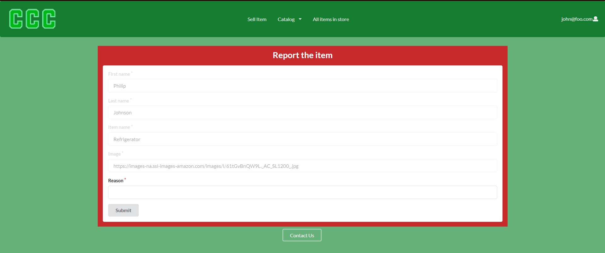
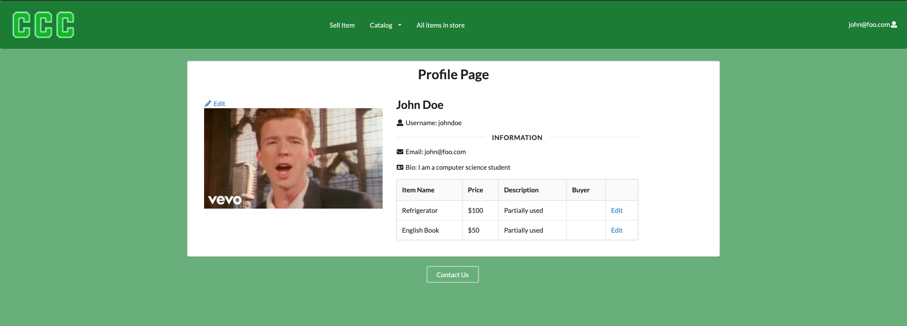
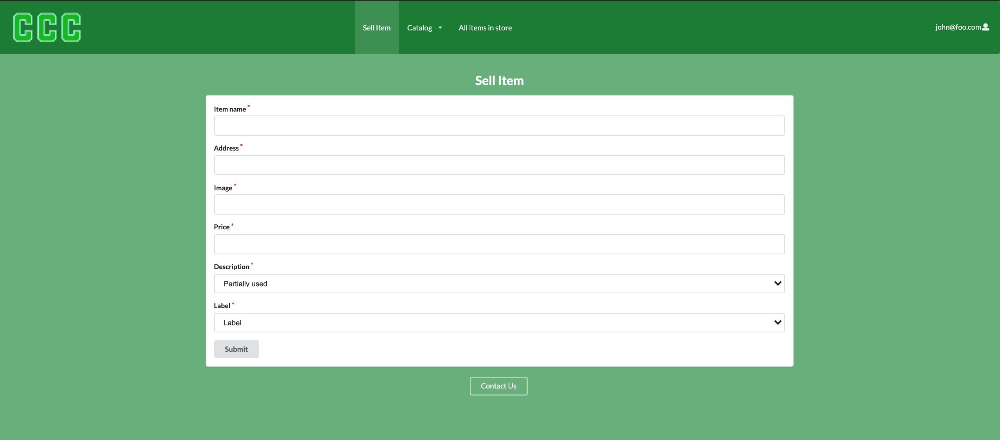

## Description
Campus Clearout Center is a program that will allow users of the UHM community to list and post various objects for sale. After all, another man's trash is another man's treasure. But for the UHM community this could be old textbooks, "campus-specific" goods, generally things that need to be recycled which might offer use to another student. The service will allow buyers to easily browse through the item and choose a location on campus to meet.

## Deployment
[Deployment](https://campusclearout.xyz/#/)

## Project Pages
- [M1](https://github.com/orgs/campus-clearout-center/projects/1)
- [M2](https://github.com/orgs/campus-clearout-center/projects/2)

## Team Members
- Skyler Kimura
- Chase Lee
- Daphne Oh
- Benny Trieu

## System
- Landing page
- User home page
- Admin home page
- User Profile page
- List Item page
- Create item page
- Make offer on item page
- Report to admin page

## Goal
By the end of the project we will have a working program that will allow users to easily post items that they would like to sell using picture, browse the items posted, and buy the items or make an offer on an item using a form.

# User Developer Guide
This section provides a walkthrough of our campus clearout center user interface and its capabilities.

### Landing page
This is the page that the viewer will first see when opening up the website. It is a nice sunset picture of campus center that is given two options in the middle which is to login and register for the website.


### User Home page
When the user signs in, They are given options above like "List Item" and "Create Item" on the top navbar alongside a profile indicator on the topright which can direct them to a profile page of their own or the option to sign out


### Admin Home page
When the admin signs in, They are given the same option that the users are given but with additional admin controls as seen on the admin button on the top of their navbar


### Log in page
Users add their username and password, and when they click submit, they are brought to the home page. If the user does not have a profile, then they can click on the "Click here to register" button.


### Register page
If the user does not have an account, they will have to enter their first and last name, email, and password. The register page will require them to enter all the information, and when they click submit their account will created. 


### List Item page
The user will be able to see all the items listed for sale as well as any items they have added to the site sorted by the labels they are categorized in. 


### List Item page (Admin)
When Admin is logged in, they will be able to see the items listed by category and also see them all at once. 


### Report page
You can also report items, they will appear for the admin to review. 



### Profile page
The User will be able to see the items they listed as well as their personal information.



### Edit Profile
The user will only be able to edit their username, bio, and picture.


### Edit Item
User's will be able to edit items they listed for sale under their profile page.


### Sell Item
When the user is ready to sell an item they can input the information and provide a picture for the item as well as the label for the item which will place it on the correct category page. 


          
 # Developer Guide
 This section provides instruction on how to install the project on your own device and view. 
 
 ## Installation 
 First [install Meteor](https://www.meteor.com/developers/install)
 
 Second, visit the [Campus Clearout Center github page](https://github.com/campus-clearout-center/clearout-center), and click the “Use this template” button to create your own repository initialized with a copy of this application. Alternatively, you can download the sources as a zip file or make a fork of the repo. However you do it, download a copy of the repo to your local computer.
 
 Third, cd into the clearout-center/app directory and install libraries with:
 ```
 $ meteor npm install
 ```
 Fourth, run the system with:
 ```
 $ meteor npm run start
 ```
 If all goes well, the application will appear at http://localhost:3000.
